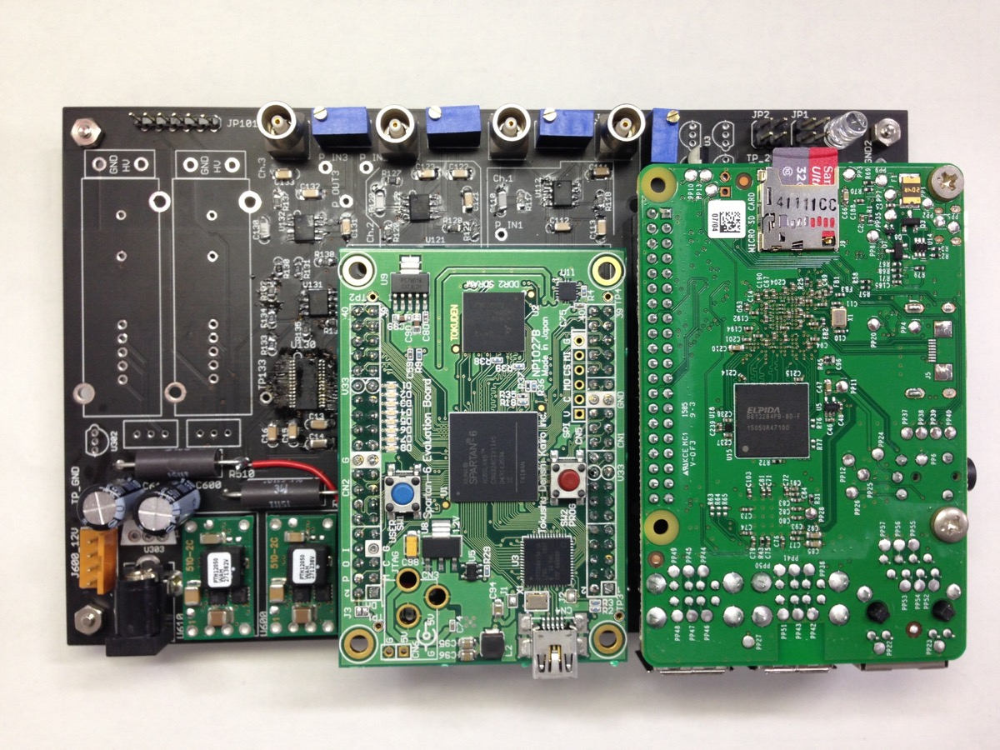
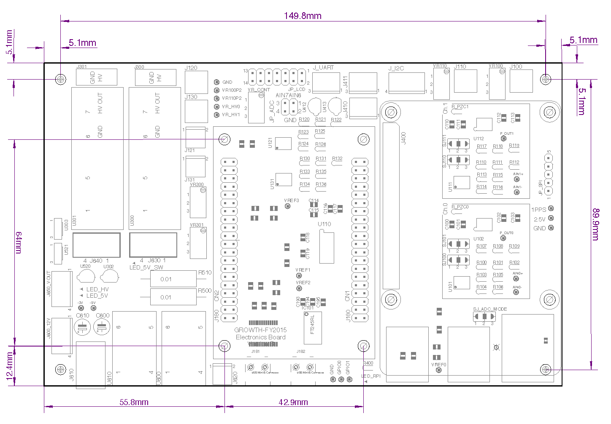
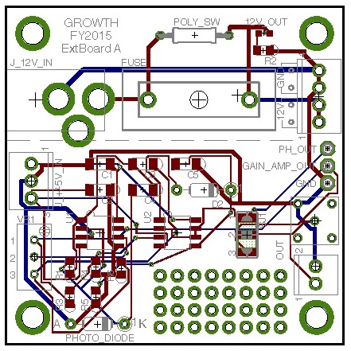

# はじめに

このマニュアルでは、GRWOTH FY2015の検出器システムの構成と、ソフトウエアの使い方、
データ解析の流れを説明します。

## 連絡先
このマニュアルは以下のメンバーによって編集されました。
情報のアップデート、誤記などはいかに連絡してください。

- 湯浅孝行 (理化学研究所)
- 榎戸輝揚 (京都大学)
- 和田有希 (東京大学)

## 記入するべきこと(A/Iリスト)
- 各セクションでTBDとなっているところを記述すること(Command+FでTBDで検索)。
- githubのレポジトリ一覧を掲載すること。
    - FPGAロジック
    - DAQソフトウエア
    - データ解析ソフトウエア
    - Raspberry Pi設定・ソフトウエアインストールスクリプト群

# 検出器システム

## 防水ボックス

タカチの防水ボックス(BCAR354520T)に、防水の電源コネクタ(七星科学の3ピンのもの)を取り付けて使用している。
防水コネクタ取り付けの加工は理研の先端工作支援チームに依頼した。防水・耐候性の電源ケーブル(設置施設の商用電源から防水ボックスまで電源をひくケーブル)は工作チームに選定してもらい、3ピンの商用電源用コネクタと、防水コネクタを取り付けてもらった。

- サイズ: (W)350 × (D)450 × (H)201 mm
- [MonotaroのBCAR354520Tのページ](http://www.monotaro.com/p/8821/8882/)

## ADCボード

FY2015の検出器システムでは、「ADCボード」をマザーボードとして、HVモジュール、FPGAボード、Raspberry Piボードを搭載して、ワンボードで信号増幅、AD変換、イベント抽出、イベントファイルへの保存、リモートサーバへのデータ伝送ができるようにしている。検出器システムを量産する際の、接続等の工作の手間を削減することと小型化・低コスト化が目的。

FY2015のVersion B製造バッチ(4台)では、フルに部品を搭載した状態で、1台15万円くらいで製造できている(通信系、HDDは除く)。

### 種類
#### Version A
2015年4-5月に設計した初版。4chの波形取得型ADCを搭載(最高60Msps)。4ch全てにPMT用プリアンプを実装。



#### Version B
2015年8-9月に設計した2版。4chの波形取得型ADCを搭載(最高60Msps)。Ch.0/1にPMT用プリアンプ、Ch.2/3は差動アンプ直結(電圧信号)。給電用のUSB Type Aコネクタを搭載。

### 寸法
- ADCボード外形寸法
    - 160 mm × 100 mm
- ADCボード固定用のネジ穴
    - ADCボードの4隅と、中央のFPGAボード用の取り付け穴の4個、合計8箇所をつかってI/Fプレートにスペーサー経由でネジ止めする。
    - FPGAボード用の穴も使うのは、FPGAボードの抜き差し時の応力でADCボードが変形しないようにするため。
    - ネジはM3。
- Raspberry Pi用のネジ穴は、I/Fプレート上には不要。

ADCボードに載せる子基板を追加製作する場合(標準装備以外のプリアンプを使う場合や、Siフォトダイオードによる光検出器を搭載する場合)は、子基板とFPGAボードをスペーサ経由で固定すること(つまり、子基板のネジ穴はFPGAボードとあわせること)。



### ブレーカーボード

ACアダプタの電源をヒューズでうけて、ADCボードに給電。過電流時にADCボードへの給電を遮断。

|  |  |
|:---:|:---:|
|入力| DC 12V (ACアダプタ)|
|出力| DC 12V (4ピンコネクタ)|
|ヒューズ|5mm × 20mm型 制限電流 TBD A|



### 電源系の整理

TBD: 電源系の系統図、どこでどのようなリミットがかかっているかを記述すること。

### FPGAボード

[特殊電子回路](https://shop.tokudenkairo.co.jp)のSpartan-6評価ボード(XC6SLX45搭載版; TKDN-SP6-45)を採用しています。

FPGAロジックはUSBコネクタ経由で、Tokudenの専用ソフトウエアを使用して書き込みます。詳細はボードに付属のマニュアルを参照してください。

FPGAロジックのソースコードとコンパイル済みのbitファイルは、gitレポジトリとして管理しています。依存しているVHDLLibraryとともに、以下のようにしてcloneしてください。

```
git clone hikari:git/GROWTH-FY2015-FPGA.git
git clone hikari:git/VHDLLibrary.git
```

ISEのプロジェクトファイルは```GROWTH-FY2015-FPGA.git/ISE/GROWTH-FY2015-FPGA.xise```です。

トップレベルのVHDLファイルは```GROWTH-FY2015-FPGA.git/VHDL/TopFile.vhdl```です。トップファイルからイベント処理ロジックやUART-SpaceWireによるデータ通信のロジックが読み込まれています。


### 高圧電源

MatsusadaのOPTON-1PA-12(プラスHV)もしくはOPTON-1NA-12(マイナスHV)を使用しています。
接続するPMT+ディバイダの特性に合わせて選択します。

高圧電源の12V電源電圧は、Raspberry PiからMOSFETを操作することでON/OFFできるようになっています。
詳細は以下のRaspberry Piの章を参照してください。


# 検出器システムのセットアップ・測定実行

## Raspberry Piのセットアップ

### セットアップ時の構成

- ディスプレイ、キーボード、マウスを接続してください。
- 電源はUSB ACアダプタ(iPadの充電器など)からmicro USBケーブル経由で供給してください。
- セットアップをしているときはADCボードには接続しないでください。

### OSをインストールする

- TBD: Raspbianのインストール方法、初期設定方法を記入する。
- TBD: GROWTH実験で使うRaspberry Piはアカウント/パスワードを統一する。

### コマンドラインの操作

標準状態ではXWindowは起動しないので、起動直後はCUI(コマンドライン)での操作になります。

GUIを使用したい場合は、piアカウントでログイン後、コマンドラインで

```
startx (リターン)
```

としてXWindowを起動してください。

CUIのまま操作することもできます。Linuxでは、複数のコマンドラインを切り替えながら使用できます。キーボードで```Ctrl+Alt+F1〜F7```を入力すると、それぞれの番号に対応したコマンドラインが表示されます。(複数のターミナルのウインドウを開いているイメージ)


### apt-getでインストールすべきもの

以下をコピーペーストして実行してください。WiFiよりも有線接続のほうが短時間でインストールできます。

```sh
sudo apt-get update
sudo apt-get install -y fswebcam 
sudo apt-get install -y git dpkg-dev make g++ gcc binutils 
sudo apt-get install -y libx11-dev libxpm-dev libxft-dev libxext-dev python-dev
sudo apt-get install -y gfortran ruby ruby-dev rails wget curl curl-dev zsh
sudo apt-get install -y build-essential curl m4 texinfo libbz2-dev
sudo apt-get install -y libcurl4-openssl-dev libexpat-dev libncurses-dev
sudo apt-get install -y zlib1g-dev chromium libx11-dev gcc-4.8 g++-4.8
sudo apt-get install -y apache2 php5 php5-mysql php5-curl php5-gd mysql-server
sudo apt-get install -y imagemagick libjpeg8-dev
sudo apt-get install -y git cmake swig subversion
sudo apt-get install -y gcc-4.8 g++-4.8 libboost1.50-all libxerces-c-dev
```

### ネットワークの設定

Raspberry Piのデフォルトでは有線LANからDHCPで割り当てられたIPアドレスを使用してインターネットに接続されます。

#### sshサーバの設定(認証鍵でのログイン許可)

パスワード入力無しで認証鍵を用いてsshログインできるように、sshサーバ(sshd)の設定を変更します。以下ようにして設定ファイルをエディタで開いて、

```
sudo nano /etc/ssh/sshd_config
```

- TBD: ここにsshd_configの設定方法を追記
- TBD: ~/.ssh/authorized_keysとconfigの記述(サーバー名を簡略化できるように)

実際に観測に使用するRaspberry Piでは、WiFiルータにWiFi経由で接続し、携帯電話回線経由でインターネットに接続できるように設定してください。

- TBD: WiFiドングルの設定、WiFiルータへの接続の設定、自動再接続の設定
- TBD: MyDNSの設定方法(MyDNSへのドメイン名登録、cronによるIPアドレス通知)


### wiringPiのインストール

GPIO/SPI/I2Cを使用するためのライブラリとして[wiringPi](http://wiringpi.com)を使用します。
以下のようにしてダウンロード・インストールしてください。

```sh
mkdir -p $HOME/work/install
cd $HOME/work/install
git clone git://git.drogon.net/wiringPi
cd wiringPi
./build

#check build
gpio -v
```

### USB HDDのマウント方法
1. デフォルト設定では、USBポートから供給できる電流が不足し、HDDを接続しても起動しません。
1. USBコネクタから供給できる電流を1.2Aまで増加させるために、```sudo nano /boot/config.txt```で、最後の行に```max_usb_current=1```を追加して再起動。
1. ```sudo mkdir /media/hdd```として、マウントポイントとなるディレクトリを作成。
1. HDDを接続し、```sudo mount /dev/sda1 /media/hdd```としてマウント。/dev/sda1以外の場合は、```sudo dmesg```でどのような名前で検出されたか確認すること。
1. HDD接続中、画面の右上に虹色のアイコンが表示されているときは、電源電圧が4.7V以下に低下しているという知らせ。
  より多く電流を引き出せるUSB ACアダプタ等に接続すること。
1. フォーマット形式がFAT32とかNTFSだと、Raspberry Pi上でファイルのパーミッションを書き換えられなくて不便。
1. もし中身が入っていないHDDなのであれば、Linuxのネイティブフォーマットにしてみてください。
  やりかたは http://frogcodeworks.com/raspberrypi-hdd-format/ を参照。

### SPI通信をenableする
HK収集用のスローADCは、Raspberry PiとSPIインタフェースで接続されています。
デフォルト状態ではSPI通信は許可されていないので、以下の手順で許可してください。

コマンドラインで

```sh
sudo raspi-config
```

として設定プログラムを起動し、

```sh
8 Advanced Options
→ A5 SPI Enable/Disable automatic loading of SPI kernel module
```

で有効にする。設定後、再起動必要。

電源投入後、初回は
```
gpio load spi
```
として、wiringPiのSPIモジュールをロードする必要があります。

SPI通信でADCが読めるかどうかの試験は、

```sh
test_readADC
```

を実行する。8chのADCが読み出され、画面に表示される。
温度センサの温度が正常な値になっていない場合は、接触不良の可能性がある。
Raspberry PiがADCボードにちゃんと刺さっているか確認すること。


### GPIOによるHV電源/5V電源の制御
#### Version Aボード
Raspberry Piのコマンドラインから
```
#出力方向の設定
gpio mode 27 out
#HV 12V on
gpio write 27 1
```
とするとHV用のMOSFETがONして、HVの電源に12Vが供給される。

#### Version Bボード
Raspberry Piのコマンドラインから
```
#出力方向の設定
gpio mode 27 out
gpio mode 26 out

#HV 12V on
gpio write 27 1
#HV 12V off
gpio write 27 0

#FPGA 5V on
gpio write 26 1
#FPGA 5V off
gpio write 26 0
```
とすると、HV用12V、FPGA用5VがそれぞれON/OFFできる。

### DAQソフトウエアのインストール

DAQソフトウエアおよび関連するライブラリは```$HOME/work/install```にインストールします。以下のコマンドを実行してください。

```
TBD: setupスクリプトの実行方法を記述する。
```


## ADCボードのセットアップ

- TBD: FPGAボード、Raspberry Piの接続方法、HVモジュールとSHVコネクタの取り付け方法
- TBD: ボード上の配線(電源、HV、PMT out)を写真付きで解説
- TBD: 必要なケーブル類のリストを掲載する(USB、自作のケーブル等)

### SMDジャンパの設定

- TBD: LEMOからの入力をどのように選択するか説明。

### ADC_CM(コモンモード)の設定

- TBD: 抵抗値を変えると変更できることを説明

## 防水ボックスへの組み込み

### 保持ジグ

- TBD: 中野くん製のジグの話を記述

### 配線

- TBD: 電源、ボックス外部の気温・気圧センサへの接続方法

# ガンマ線イベントの取得

## 積分時間を指定した実行

以下のようにDAQソフトウエアを実行すると、指定した積分時間でガンマ線データの取得ができます。

```
growth_fy2015_adc_measure_exposure /dev/ttyUSB0 configuration_20151022_xxxx.yaml 1800
```

このDAQソフトウエアでは、実行時刻がファイル名となってイベントファイルが保存されます。

```
例: 20151026_0010.fits
```

## 観測時のループ実行

- TBD: 観測用スクリプトの実行方法を記述する。
- TBD: rsync用スクリプトの実行方法を記述する。

## コンフィグレーションファイルの内容

```yaml
DetectorID: fy2015_version_a                 # detector ID (e.g. fy2015a, fy2015b, ... )
PreTriggerSamples: 31                        # look-back samples (max 32)
PostTriggerSamples: 800                      # number of samples after trigger
SamplesInEventPacket: 831                    # number of samples stored in the event packet
DownSamplingFactorForSavedWaveform: 1        # reserved
ChannelEnable: [yes,yes,yes,yes]             # channel enable for ch. 0/1/2/3
TriggerThresholds: [810, 510, 810, 520]      # threshold for ch. 0/1/2/3
TriggerCloseThresholds: [800, 490, 800, 500] # trigger close threshold for ch. 0/1/2/3
```

___注意___

- DetecotrIDはFITSファイルのヘッダに記録されます。
- PreTriggerSamplesはトリガ前の波形を、FPGA内部のイベント処理の中でどれくらい残すかを指定します。
  イベントファイルに記録されるbaselineは、記録した波形の最初の4サンプルの平均を出しているので、
  トリガ地点よりある程度戻っておかないと正確なベースラインになりません。
  通常は```PreTriggerSamples: 32```としておけば良いと思います。
  最大値(32)以上の値を設定すると、```PreTriggerSamples: 0```としたことと同じ動作になります。
- SamplesInEventPacketを増やすと、イベントファイルの中に記録される波形が長くなります。
  同時に、イベントパケット1個のサイズも増加するため、シリアル通信で読み出せるデータレートを簡単に
  超えてしまい、FPGA内部でバッファフルが発生し、トリガしたイベントが捨てられることになります。
  たとえば、アンプ回路のデバッグのときは波形をたくさん残すようにして、正常動作が確認できたあと、
  長時間観測のときは```SamplesInEventPacket: 1```にする、という使い方が良いと思います。

## 出力されるFITSファイル

ROOTをそのまま動作させるのはRaspberry Piにとっては結構な負荷になるので、
Raspberry Pi上のDAQソフトウエアでは、ROOTファイル形式は採用していません(Macでは使えます)。
代わりに、cfitsioを用いてFITSファイルとしてイベントリストを保存します。
FITS形式の場合、イベントリストをfvで開いて直接中身をみたり、phaMaxをヒストグラムとして詰めたり、
waveformをプロットしたりできるので、それなりの良さが有ります。fselectを使うと、特定のイベントだけ
抜き出すこともできます。

以下にFITS形式のイベントリストファイルのフォーマットを解説します。

### EVENTS extension

EVENTS extensionのヘッダは以下のようになっています。

```yaml
XTENSION= 'BINTABLE'           / binary table extension
BITPIX  =                    8 / 8-bit bytes
NAXIS   =                    2 / 2-dimensional binary table
NAXIS1  =                   27 / width of table in bytes
NAXIS2  =                32000 / number of rows in table
PCOUNT  =                    0 / size of special data area
GCOUNT  =                    1 / one data group (required keyword)
TFIELDS =                   11 / number of fields in each row
TTYPE1  = 'boardIndexAndChannel' / label for field   1
TFORM1  = 'B       '           / data format of field: BYTE
TTYPE2  = 'timeTag '           / label for field   2
TFORM2  = 'K       '           / data format of field: 8-byte INTEGER
TTYPE3  = 'triggerCount'       / label for field   3
TFORM3  = 'I       '           / data format of field: 2-byte INTEGER
TZERO3  =                32768 / offset for unsigned integers
TSCAL3  =                    1 / data are not scaled
TTYPE4  = 'phaMax  '           / label for field   4
TFORM4  = 'I       '           / data format of field: 2-byte INTEGER
TZERO4  =                32768 / offset for unsigned integers
TSCAL4  =                    1 / data are not scaled
TTYPE5  = 'phaMaxTime'         / label for field   5
TFORM5  = 'I       '           / data format of field: 2-byte INTEGER
TZERO5  =                32768 / offset for unsigned integers
TSCAL5  =                    1 / data are not scaled
TTYPE6  = 'phaMin  '           / label for field   6
TFORM6  = 'I       '           / data format of field: 2-byte INTEGER
TZERO6  =                32768 / offset for unsigned integers
TSCAL6  =                    1 / data are not scaled
TTYPE7  = 'phaFirst'           / label for field   7
TFORM7  = 'I       '           / data format of field: 2-byte INTEGER
TZERO7  =                32768 / offset for unsigned integers
TSCAL7  =                    1 / data are not scaled
TTYPE8  = 'phaLast '           / label for field   8
TFORM8  = 'I       '           / data format of field: 2-byte INTEGER
TZERO8  =                32768 / offset for unsigned integers
TSCAL8  =                    1 / data are not scaled
TTYPE9  = 'maxDerivative'      / label for field   9
TFORM9  = 'I       '           / data format of field: 2-byte INTEGER
TZERO9  =                32768 / offset for unsigned integers
TSCAL9  =                    1 / data are not scaled
TTYPE10 = 'baseline'           / label for field  10
TFORM10 = 'I       '           / data format of field: 2-byte INTEGER
TZERO10 =                32768 / offset for unsigned integers
TSCAL10 =                    1 / data are not scaled
TTYPE11 = 'waveform'           / label for field  11
TFORM11 = '1I      '           / data format of field: 2-byte INTEGER
TZERO11 =                32768 / offset for unsigned integers
TSCAL11 =                    1 / data are not scaled
EXTNAME = 'EVENTS  '           / name of this binary table extension
FILEDATE= '20151023_000859'    / fileCreationDate
DET_ID  = 'fy2015_version_a'   / detectorID
NSAMPLES=                    1 / nSamples
EXPOSURE=             1.80E+03 / exposure specified via command line
HISTORY YAML-- DetectorID: fy2015_version_a
HISTORY YAML-- PreTriggerSamples: 31
HISTORY YAML-- PostTriggerSamples: 800
HISTORY YAML-- SamplesInEventPacket: 1
HISTORY YAML-- DownSamplingFactorForSavedWaveform: 1
HISTORY YAML-- ChannelEnable: [no,yes,no,no]
HISTORY YAML-- TriggerThresholds: [810, 500, 810, 800]
HISTORY YAML-- TriggerCloseThresholds: [800, 495, 800, 800]
HISTORY YAML--
END
```

detectorIDは```DET_ID```に記録されます。

```
DET_ID  = 'fy2015_version_a'   / detectorID
```

イベントパケットに記録されたwaveformのサンプル数は```NSAMPLES```に記録されています。
この数が、waveformカラムの要素数に対応します。
長時間観測のように、波形を記録しなくてよい場合は長さ1にしてください。

```
NSAMPLES=                    1 / nSamples
```

コマンドラインで指定した測定時間は秒単位でEXPOSUREに記録されます。
```
EXPOSURE=             1.80E+03 / exposure specified via command line
```

```HISTORY YAML--```の行は、configuration fileのコピーを保存しています。


カラム定義は以下のようになっています。

|TTYPE|TFORM|TZERO|データ型|コメント|
|:---:|:---:|:---:|:---:|:---|
|boardIndexAndChannel|B|-|uint8_t|チャネル番号|
|timeTag|K|-|int64_t|FPGAローカルクロックのtime tag(48bit; 20ns刻み)|
|triggerCount|I|32768|uint16_t|トリガカウンタ|
|phaMax|I|32768|uint16_t|最大波高値|
|phaMaxTime|I|32768|uint16_t|最大波高値を迎えたサンプル番号|
|phaMin|I|32768|uint16_t|最小波高値|
|phaFirst|I|32768|uint16_t|トリガ内の最初のサンプルの波高値|
|phaLast|I|32768|uint16_t|トリガ内の最後のサンプルの波高値|
|maxDerivative|I|32768|uint16_t|トリガした波形内の微分の絶対値の最大値|
|baseline|I|32768|uint16_t|トリガした波形の最初の4サンプルの平均値|
|waveform|I×N|32768|uint16_t|波形データ(N=nSamples)|

### GPS extension

GPSの1PPSにあわせて記録されたFPGAのローカルクロックのtime tagと、GPSの絶対時刻の文字データを記録しています。後段の時刻付ソフトウエアで較正データとして使用します。

|TTYPE|TFORM|TZERO|データ型|FPGAローカルクロック(48bit; 20ns刻み)|
|:---:|:---:|:---:|:---:|:---|
|timeTag|K|-|int64_t|FPGAローカルクロックのtime tag(48bit; 20ns刻み)|
|gpsTime|20A|char[20]|GPSのYYMMDD HH:MM:SS|
|unixTime|J|2147483648|uint32_t|Raspberry Pi上のUNIX Time|

# データ解析の流れ

1. FITSファイルからROOTファイルへの変換
1. 時刻付け
    - GPSモード
    - FPGAフリーランクロックモード
1. ゲイン関数構築
    - 時間分割スペクトルの抽出
    - 環境ガンマ線ラインをフィット
    - ゲイン関数DBファイルを保存
1. エネルギー付け
    - ゲイン関数DBファイルを用いてエネルギー付け
1. エネルギーフィルタリング
1. ライトカーブ作成
1. 時間変動イベント自動抽出
    - エネルギー選別条件、sigma、running averageの幅を変えて

### 時刻付け

注意するべきこと

- PCで記録したunixTimeと、FPGAで記録したtimeTagのドリフトの検証
- GPS HKを持っている場合は、それを使って時刻付けする
- 時刻付の結果をヘッダ情報としてTObjStringで書きだす


### ゲイン関数構築

注意するべきこと

- 複数のファイルから連続的なゲイン関数を構築できるようにする
- フィット結果をプロットしてROOTファイルに保存しておく
    - ひと目でチェックしたり、印刷できるようにしておく
- ラインの場所や強度について、ヒント(フィットの初期値)を外部ファイルで指定できるようにしておく


### 時間変動イベント自動抽出
- 511 keV領域だけに注目してライトカーブを抜き出すとどうなるか
    - e.g. 1秒以下で5シグマ変動しているイベントはあるか、みたいな解析


## HKファイルの解析
### Step 1: FITSファイルへの変換

使用するスクリプト:

```sh
growth_hk_convert_to_fits.rb [HK text file name (comma concatenated for multiple inputs)] [output FITS file name]
```

実行例:

```sh
growth_hk_convert_to_fits.rb \
"hk_20150212_003954.data,hk_20150212_014822.data,hk_20150212_025650.data,hk_20150212_040518.data,
(中略)
hk_20150212_233241.data" hk_20150212.fits
```

### Step 2: プロファイルのプロット
ahQuickLookPlotHK.rbというスクリプトを使用する。

YAML形式の設定ファイルで、プロットしたいFITSのカラム名や軸ラベルを指定すると、
見栄えの良いプロットを生成してくれる。

gitレポジトリが以下から取得可能。

```sh
git clone galaxy.astro.isas.jaxa.jp:/git/common/ahQuickLookPlotHK.git
```

実行には以下のソフトウエアが必要。

- ROOT (Homebrewでインストール)
- RubyFits (Homebrewでインストール)
- RubyROOT (Homebrewでインストール)

```
brew tap yuasatakayuki/hxisgd
brew install root rubyfits rubyroot
```


使用するスクリプト:

```sh
ahQuickLookPlotHK.rb (configuration file) (HK FITS file to be plotted) (output prefix)
```

実行例:

```sh
ahQuickLookPlotHK.rb config_hk_plot_fy2014.yaml hk_20150212.fits hk_20150212
```

上記のコマンドを実行すると、


configuration fileのテンプレートは、

```sh
ahQuickLookPlotHK.rb -g
```

とすると作成されるので、その中身を参照。

たとえば、config_hk_plot_fy2014.yamlの冒頭部分は以下のとおり。

```yaml
temperature:
    type: graph
    title: Temperature/Humidity
    xcolumn: unixTime
    ycolumn: 
        HK/temperature:
            legend: Temp
        HK/humidity:
            legend: Hum
    xlabel: "Time JST"
    ylabel: "Temperature degC / Humidity %"
    yrange: -10 80
    options:
        skip: 10
        time_in_unixtime: yes
        time_zone: JST

command:
    type: graph
    title: Command Receive Counter / Status
    xcolumn: unixTime
    ycolumn: 
        HK/receiveCounter:
            legend: Receive Counter
        HK/commandID:
            legend: Command ID
        HK/commandStatus:
            legend: Status
    xlabel: "Time JST"
    ylabel: "Counter value"
    #yrange: -1 20
    options:
        skip: 10
        time_in_unixtime: yes
        time_zone: JST
```

### プロットの結合
上記の例で生成されるall PDFを、1枚にまとめて印刷したいときは以下のコマンドを実行する。

事前に[Mac TeX](https://tug.org/mactex/)をインストールしておく必要がある。

```
pdfnup --nup 2x3 --suffix '2x3' hk_20150212_all.pdf
open hk_20150212_all_2x3.pdf
```
