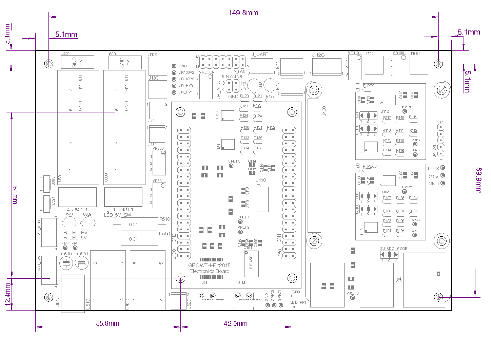
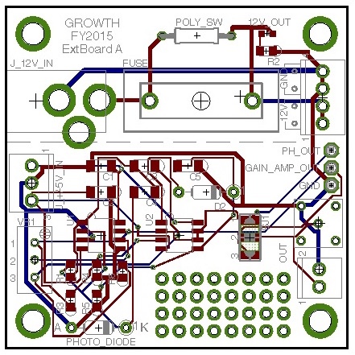

# 検出器システムの概要

## 防水ボックス

タカチの防水ボックス(BCAR354520T)に、防水の電源コネクタ(七星科学の3ピンのもの)を取り付けて使用している。
防水コネクタ取り付けの加工は理研の先端工作支援チームに依頼した。防水・耐候性の電源ケーブル(設置施設の商用電源から防水ボックスまで電源をひくケーブル)は工作チームに選定してもらい、3ピンの商用電源用コネクタと、防水コネクタを取り付けてもらった。

- サイズ: (W)350 × (D)450 × (H)201 mm
- [MonotaroのBCAR354520Tのページ](http://www.monotaro.com/p/8821/8882/)

## ADCボード

FY2015の検出器システムでは、「ADCボード」をマザーボードとして、HVモジュール、FPGAボード、Raspberry Piボードを搭載して、ワンボードで信号増幅、AD変換、イベント抽出、イベントファイルへの保存、リモートサーバへのデータ伝送ができるようにしている。検出器システムを量産する際の、接続等の工作の手間を削減することと小型化・低コスト化が目的。

FY2015のVersion B製造バッチ(4台)では、フルに部品を搭載した状態で、1台15万円くらいで製造できている(通信系、HDDは除く)。

### 種類
#### Version A
2015年4-5月に設計した初版。4chの波形取得型ADCを搭載(最高60Msps)。4ch全てにPMT用プリアンプを実装。


#### Version B
2015年8-9月に設計した2版。4chの波形取得型ADCを搭載(最高60Msps)。Ch.0/1にPMT用プリアンプ、Ch.2/3は差動アンプ直結(電圧信号)。給電用のUSB Type Aコネクタを搭載。

### 寸法
- ADCボード外形寸法
    - 160 mm × 100 mm
- ADCボード固定用のネジ穴
    - ADCボードの4隅と、中央のFPGAボード用の取り付け穴の4個、合計8箇所をつかってI/Fプレートにスペーサー経由でネジ止めする。
    - FPGAボード用の穴も使うのは、FPGAボードの抜き差し時の応力でADCボードが変形しないようにするため。
    - ネジはM3。
- Raspberry Pi用のネジ穴は、I/Fプレート上には不要。

ADCボードに載せる子基板を追加製作する場合(標準装備以外のプリアンプを使う場合や、Siフォトダイオードによる光検出器を搭載する場合)は、子基板とFPGAボードをスペーサ経由で固定すること(つまり、子基板のネジ穴はFPGAボードとあわせること)。



### ブレーカーボード

ACアダプタの電源をヒューズでうけて、ADCボードに給電。過電流時にADCボードへの給電を遮断。

|  |  |
|:---:|:---:|
|入力| DC 12V (ACアダプタ)|
|出力| DC 12V (4ピンコネクタ)|
|ヒューズ|5mm × 20mm型 制限電流 TBD A|



### 電源系の整理

TBD: 電源系の系統図、どこでどのようなリミットがかかっているかを記述すること。

### FPGAボード

[特殊電子回路](https://shop.tokudenkairo.co.jp)のSpartan-6評価ボード(XC6SLX45搭載版; TKDN-SP6-45)を採用しています。

FPGAロジックはUSBコネクタ経由で、Tokudenの専用ソフトウエアを使用して書き込みます。詳細はボードに付属のマニュアルを参照してください。

FPGAロジックのソースコードとコンパイル済みのbitファイルは、gitレポジトリとして管理しています。依存しているVHDLLibraryとともに、Chapter 1を参照して取得してください。

ISEのプロジェクトファイルは```GROWTH-FY2015-FPGA.git/ISE/GROWTH-FY2015-FPGA.xise```です。

トップレベルのVHDLファイルは```GROWTH-FY2015-FPGA.git/VHDL/TopFile.vhdl```です。トップファイルからイベント処理ロジックやUART-SpaceWireによるデータ通信のロジックが読み込まれています。


### 高圧電源

Matsusadaの[OPTON-1PA-12](http://www.matsusada.co.jp/hvps/opton-a/)(プラスHV)もしくは[OPTON-1NA-12](http://www.matsusada.co.jp/hvps/opton-a/)(マイナスHV)を使用しています。接続するPMT+ディバイダの特性に合わせて極性を選択します。

高圧電源の12V電源電圧は、Raspberry PiからMOSFETを操作することでON/OFFできるようになっています。詳細は以下のRaspberry Piの章を参照してください。

- [OPTON-Aシリーズのデータシート(PDF)](http://www.matsusada.co.jp/pdf/opton-a.pdf)
- 購入時に依頼すると、ピン配置、HV値設定方法を説明したもう少し詳細なデータシートが入手できます。
